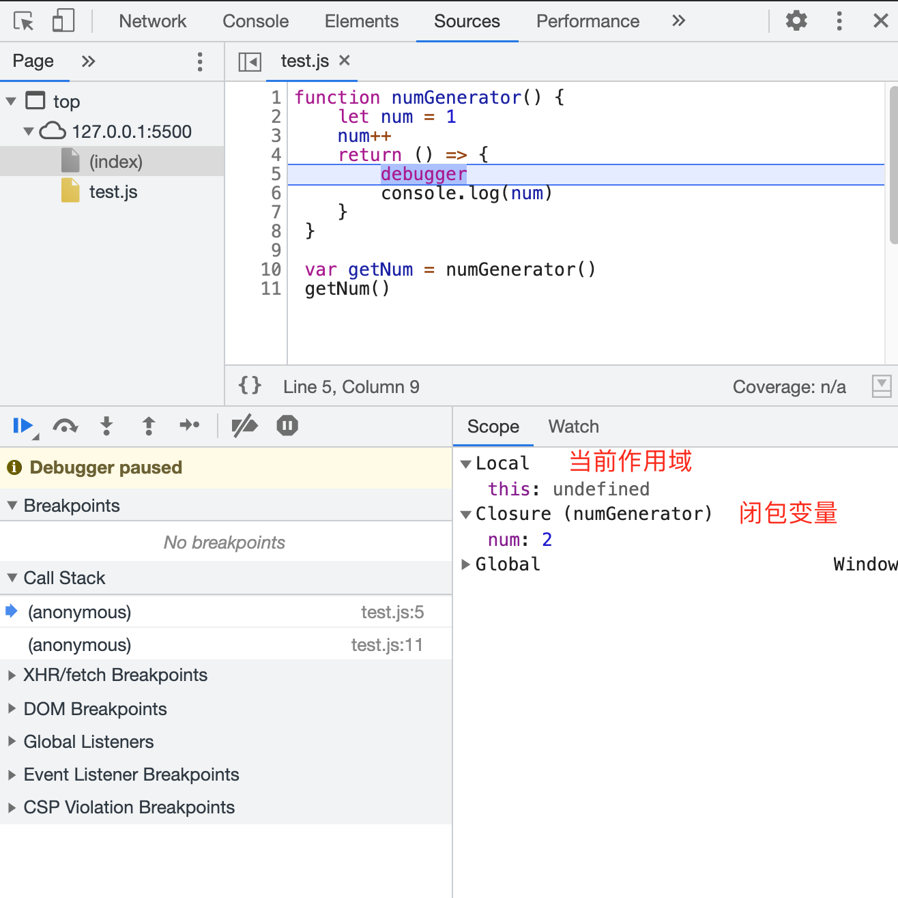

### GET/POST 长度和缓存

浏览器

- IE 和 Safari 浏览器 限制 2k
- Opera 限制4k
- Firefox 限制 8k（非常老的版本 256byte）

服务端

- Apache 8192 byte
- Microsoft Internet Information Server(IIS) 16 384 byte
- Perl HTTP::Daemon 8k 当url超过8k时会返回`413`错误
- ngnix `client_header_buffer_size` 默认 1k; `large_client_header_buffers 4`默认 4k/8k

[简书-GET传参最大长度的理解误区](/static/bibao.png)

### 闭包


一句话可以概括：闭包就是能够读取其他函数内部变量的函数，或者子函数在外调用， 子函数所在的父函数的作用域不会被释放。

#### 1.1. 作用域 ([Scope](https://developer.mozilla.org/zh-CN/docs/Glossary/Scope))

- 概念: 当前的执行上下文。值 (en-US)和表达式在其中 "可见" 或可被访问到的上下文
- 特性（单向查找）: 子作用域可以访问父作用域，通常是指沿着链式的作用域链查找，而不能从父作用域引用子作用域中的变量和引用
- 特例: 闭包
- 补充: ES6前只有**函数作用域**和**全局作用域**；ES6后支持**块级作用域**和**暂时性死区**

#### 1.2. 作用域和作用域链

> 作用域其实就是一套规则：这个规则用于确定在特定场景下如何查找变量。任何语言都有作用域的概念，同一种语言在演进过程中也会不断完善其作用域规则。比如，在 JavaScript 中，ES6 出现之前只有函数作用域和全局作用域之分。
> 在 JavaScript 执行一段函数时，遇见变量读取其值，这时候会「就近」先在函数内部找该变量的声明或者赋值情况。这里涉及「变量声明方式」以及「变量提升」的知识点，我们后面会涉及到。如果在函数内无法找到该变量，就要跳出函数作用域，到更上层作用域中查找。这里的「更上层作用域」可能也是一个函数作用域。同时「更上层作用域」也可以顺着作用域范围向外扩散，一直找到全局作用域。
> 变量作用域的查找是一个扩散过程，就像各个环节相扣的链条，逐次递进，这就是作用域链说法的由来

#### 1.3. 变量提升和暂时性死区

见笔记 `Quiver: moran-es6 - var let const`

暂时性死区 TDZ（Temporal Dead Zone）

```javascript
function foo() {
   console.log(bar)
   let bar = 3
}
foo() // Uncaught ReferenceError: bar is not defined
```

使用 let 或 const 声明变量，会针对这个变量形成一个封闭的块级作用域，在这个块级作用域当中，如果在声明变量前访问该变量，就会报 referenceError 错误；如果在声明变量后访问，则可以正常获取变量值:

```javascript
function foo() {
   let bar = 3
   console.log(bar)
}
foo() // 3
```

因此在相应花括号形成的作用域中，存在一个「死区」，起始于函数开头，终止于相关变量声明的一行。在这个范围内无法访问 let 或 const 声明的变量。这个「死区」的专业名称为： TDZ（Temporal Dead Zone），相关语言规范的介绍读者可参考 [ECMAScript® 2015 Language Specification](https://262.ecma-international.org/6.0/#sec-let-and-const-declarations)

#### 2.1. 代码执行的两个阶段

> 执行上下文就是当前代码的执行环境/作用域，和前文介绍的作用域链相辅相成，但又是完全不同的两个概念。直观上看，执行上下文包含了作用域链，同时它们又像是一条河的上下游：有了作用域链，才有了执行上下文的一部分。

!> 理解JS运行机制

- JavsScript 是解释型语言，编译一行，执行一行。但是
- JS代码执行的两个阶段: 预编译 + 执行
- **JS预编译**: 预编译和传统的编译并不一样，传统的编译非常复杂，涉及分词、解析、代码生成等过程 。这里的预编译是 JavaScript 中独特的概念，在代码执行前，JavaScript 引擎会做一些「预先准备工作」。在通过**语法分析**，确认语法无误之后，JavaScript 代码在预编译阶段对**变量的内存空间进行分配**，我们熟悉的**变量提升**过程便是在此阶段完成的
- **执行阶段**: 主要任务是执行代码，**执行上下文**在这个阶段全部创建完成。

预编译的三个注意点:

- 预编译阶段进行变量声明；
- 预编译阶段变量声明进行提升，但是值为 undefined；
- 预编译阶段所有**非表达式的函数声明**进行提升。(即表达式形式的函数赋值声明是在执行阶段进行)

总结：

- 预编译: **创建作用域** 变量提升(变量与函数，不包括声明式函数) 分配内存空间
- 执行阶段: **执行上下文创建** 执行代码即 1. 变量赋值(变量由声明状态转为激活状态) 2. 函数调用(形成作用域链)
- 执行上下文: 执行上下文包括了：变量对象、作用域链以及 this 的指向

#### 2.2. 调用栈


个人理解：

如果创建一门语言，需要解决函数调用函数的问题，最优的解决方案就是**栈**的形式，即「先进后出」（「后进先出」）

> 在函数执行完毕并出栈时，函数内局部变量在下一个垃圾回收节点会被回收，该函数对应的执行上下文将会被销毁，这也正是我们在外界无法访问函数内定义的变量的原因。也就是说，只有在函数执行时，相关函数可以访问该变量，该变量在预编译阶段进行创建，在执行阶段进行激活，在函数执行完毕后，相关上下文被销毁。

#### 3. 闭包

- 构造一个闭包：
```javascript
function numGenerator() {
   let num = 1
   num++
   return () => {
       console.log(num)
   }
}
var getNum = numGenerator()
getNum() // 2
```

- 什么是闭包？

 ?> 函数嵌套函数时，**内层函数引用了外层函数作用域下的变量**，并且**内层函数在全局环境（改成外界更准确）下可访问**，就形成了闭包。

 ?> MDN闭包: 一个函数和对其周围状态（lexical environment，词法环境）的引用捆绑在一起（或者说函数被引用包围），这样的组合就是闭包（closure）。也就是说，闭包让你可以在一个内层函数中访问到其外层函数的作用域。在 JavaScript 中，每当创建一个函数，闭包就会在函数创建的同时被创建出来。


 

- 为什么设计闭包

 闭包这种结构为 JavaScript 中**访问函数内变量**提供了途径和便利

- 闭包应用

 可以利用闭包实现 **「模块化」**；再比如，翻看 Redux 源码的**中间件**实现机制，也会发现（函数式理念）大量运用了闭包。

#### 4.1. 内存管理

内存空间可以分为栈空间和堆空间

- 栈空间：由操作系统自动分配释放，存放函数的参数值，局部变量的值等，其操作方式类似于数据结构中的栈。
- 堆空间：一般由开发者分配释放，这部分空间就要考虑垃圾回收的问题。
- 基本数据类型保存在栈内存当中，引用类型保存在堆内存当中。

#### 4.2. 内存泄露

指内存空间明明已经不再被使用，但由于某种原因并没有被释放的现象。这是一个非常「玄学」的概念，因为内存空间是否还在使用，某种程度上是不可判定问题，或者判定成本很高。内存泄漏危害却非常直观：它会直接导致程序运行缓慢，甚至崩溃。

#### 4.3. 浏览器垃圾回收

除了开发者主动保证以外，大部分的场景浏览器都会依靠：

- 标记清除
- 引用计数

#### 4.4. 内存泄漏/垃圾回收注意事项

注意事项

- 内存泄漏和垃圾回收，要在实战中分析，不能完全停留在理论层面，毕竟如今浏览器千变万化且一直在演进当中。
- 借助闭包来绑定数据变量，可以保护这些数据变量的内存块在闭包存活时，始终不被垃圾回收机制回收。因此，闭包使用不当，极可能引发内存泄漏，需要格外注意。

前端人员可以做的事情

- 使用null清除变量空间
- 对于侦听器 removeEventListener
- 回收定时器 clearInterval/clearTimeout + xxx = null

#### 4.5. Chrome devtool 定位内存泄漏

- 使用[performance]标签 拍摄快照 观察不同颜色(JS heap、Node)的折线趋势
- 使用[memory]标签 对JS heap的每一项进行检查，重点观察size较大的前几项